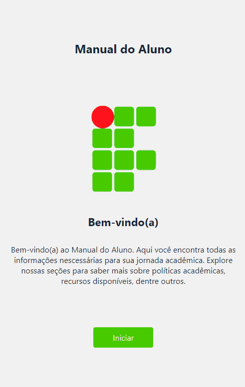

# Projeto Manual do Aluno - IFNMG - Campus Pirapora (TCC II)

O presente trabalho tem como objetivo demonstrar a utilização do React Native na criação de aplicativos mobile, desenvolvendo uma aplicação multiplataforma focada em oferecer uma interface intuitiva e prática, que possa auxiliar os alunos da instituição a se manterem informados sobre seus direitos e deveres trazendo consigo a permanência e êxito dos estudantes dentro do campus.

## Telas da aplicação:

## Requisitos do projeto:

Os requisitos listados a seguir surgiram a partir da ideia principal do aplicativo e
do que ele poderia ser futuramente. Sendo que para este feito foi realizada conversas com
membros do instituto, para que pudessem ser repassadas a regularidade das informações
que seram apresentadas inicialmente, sendo elas:

# Primeiro:

1. Informações Gerais do Campus: apresentar qual a missão e visão do instituição, a
   história por trás do campus e seus contatos principais.

# Segundo:

2. Politícas Acadêmicas: apresentar as principais políticas existentes dentro do campus.

# Terceiro:

3. Recursos Acadêmicos: descrever sobre a utilização da biblioteca e dos laboratórios
   presentes no instituto.

# Quarto:

4. Serviços de Apoio ao Estudante: Informar ao estudante sobre a política de assistência
   estudantil que o campus fornece.

# Quinto:

5. Calendário Acadêmico: a aplicação deve apresentar o calendário acadêmico referente
   ao ano letivo de 2024 e 2025 do ensino superior, ensino médio e curso técnico,
   contendo todos os eventos de cada mês.

## Teclonogias utilizadas :

- HTML
- CSS
- TS
- React
- React Native
